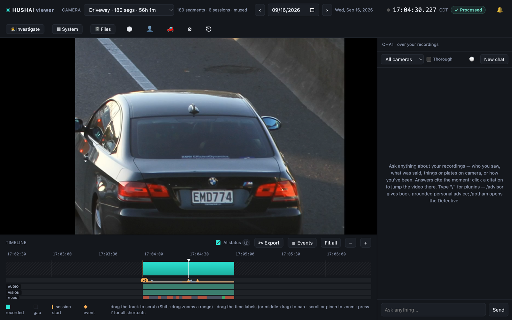
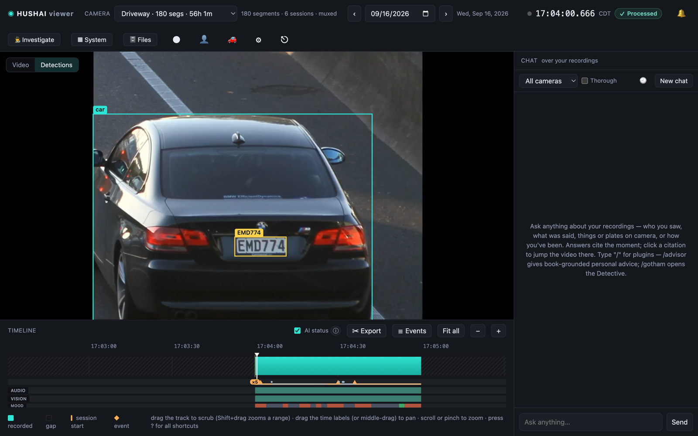
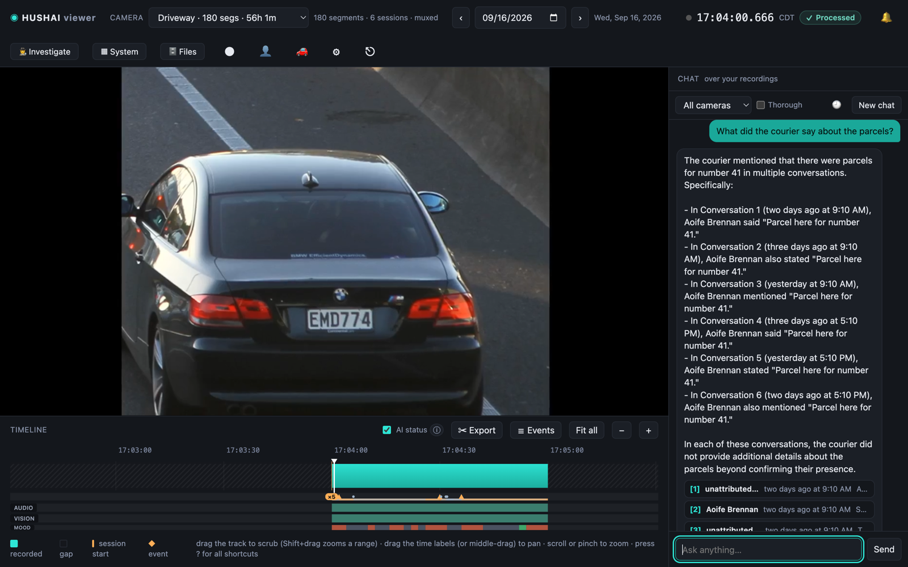
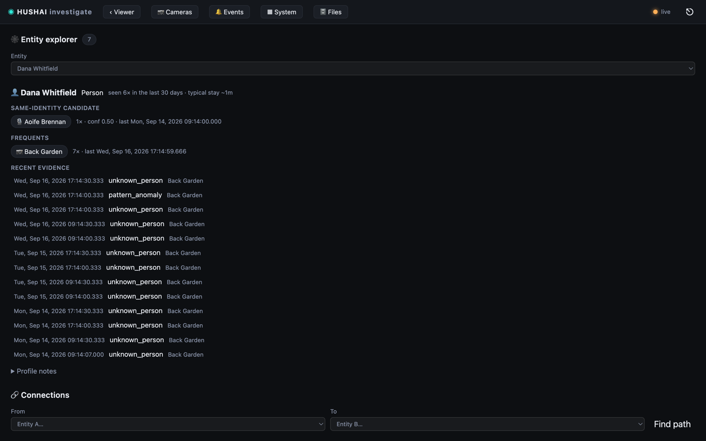
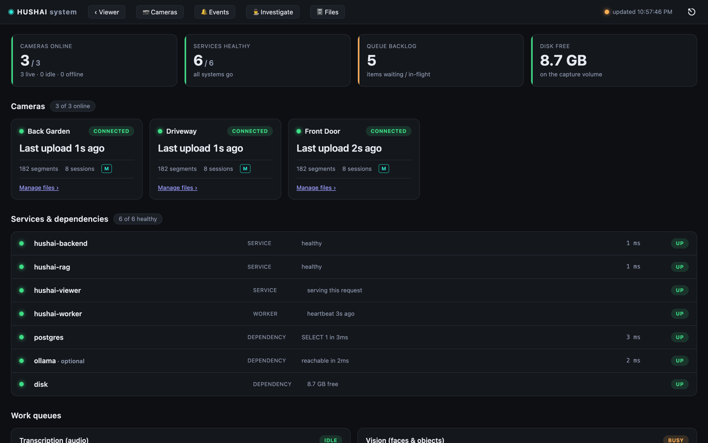
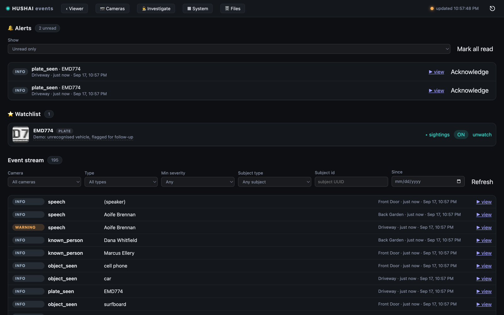

# Screenshots

Every image in the README is captured from a running stack against a **demo database** — public-domain
source photographs and synthesized dialogue, never real footage.

## Regenerating them

```bash
createdb hushai_demo
DATABASE_URL="postgres://$USER@localhost:5432/hushai_demo" \
BLOB_DIR="$PWD/local_dev/.demo_work/blobs" \
VISION_MOTION_SKIP_ENABLED=false VIEWER_AUTH_DISABLED=true \
  ./local_dev/run_stack.sh &

./local_dev/build_demo.sh            # build + inject + process the demo dataset (~1h: the
                                     # worker has to transcribe and see all 540 segments)
cd hushai-viewer/e2e && npm i

# Pass 1 — the four player shots, with NOTHING feeding the stack
SHOTS_PASS=player node shots.mjs

# Pass 2 — the two status pages, which need cameras that look alive
cd ../.. && ./local_dev/demo_live_feed.sh &
(cd hushai-viewer/e2e && SHOTS_PASS=live node shots.mjs)
kill %1 && ./local_dev/demo_live_feed.sh --cleanup
```

### Why two passes

They genuinely cannot be combined, and the failure mode is silent rather than loud.

The dashboard and the camera wall classify a camera purely on how recently it uploaded — under 15s
is `live`, under 5m is `idle`, anything older is `offline`
([cameras.js:20](../hushai-viewer/ui/js/cameras/cameras.js#L20)). A dataset injected once and then
left alone is therefore three red OFFLINE cameras and a red `0 / 3 CAMERAS ONLINE` within five
minutes, which screenshots a perfectly healthy stack as a broken one. `demo_live_feed.sh` fixes
that by replaying one 2-second segment per camera every 8 seconds.

But that same replay moves each camera's newest segment to *now*, and the player can only navigate
the last `VIEWER_MAX_WINDOW_NANOS` (6h by default) of footage measured back from there:
`refetchTimeline` asks for the whole range, `clamp_window` returns only its most recent slice, and
`snapToCovered` then drags any older seek forward to the live edge. With the feeder running, every
frame of the demo's own footage is out of reach — so the player shots land on the live tail and
draw its one-segment-per-8s trickle as a picket fence, as if the recorder dropped three quarters of
its input. Hence: player shots first, on an untouched dataset; feeder second.

`--cleanup` afterwards is not housekeeping. It deletes the replay's segments and their events so
the demo footage is navigable again; skip it and the *next* `SHOTS_PASS=player` run silently
photographs the live tail. It cannot undo cumulative entity-graph counters, so if those matter,
rebuild with `DEMO_RESET=1 ./local_dev/build_demo.sh`.

`shots.mjs` drives **real Google Chrome** through `puppeteer-core`. Open-source Chromium has no
H.264/AAC, so the player never decodes and every shot of the timeline comes out blank.

## No faces, on purpose

Two of the demo's three cameras are built from public-domain **portrait photographs of real,
identifiable people** (official NASA astronaut portraits). A published screenshot of a surveillance
product is not the place for someone's face, even a public-domain one, so the captured set shows
the vehicle camera, text and chrome only. Concretely:

- The player shots prefer a vehicle/plate camera over a face camera. Override with
  `SHOTS_DEVICE=<device_id>`.
- There is **no camera-wall shot**. `cameras.html` renders a poster frame per camera, so the wall
  is a grid of faces.
- `build_demo.sh` puts the **plate** on the watchlist rather than a person: the watchlist row
  renders a crop of its subject, and a `person` subject would be a face crop.
- Shot 04 stays scrolled at the entity card and never pages down to the identity-binding review
  queue, which renders a `.binding-face` crop per candidate.

If you add a shot, check it against that list first.

The vehicle footage carries a legible registration, `EMD774`. It comes from a public-domain
photograph already published on Wikimedia (the same fixture
[docs/perception-hardening.md](perception-hardening.md) uses to calibrate the plate lane), so the
screenshot discloses nothing that was not already public — but it is a real plate, not a synthetic
one, and worth knowing about before reusing these images.

## The shots

### 1 · The timeline



One continuous timeline stitched from thousands of 2-second segments, with a day picker, a speed
ladder, GO LIVE, clip export, and per-second AI processing ribbons showing how far the audio and
vision lanes have got. The harness parks the playhead on the midpoint of the longest *reachable*
recorded span, so the shot can never land on a correctly-empty stretch.

### 2 · Detections



The Detections tab draws the worker's output over the frame: people and faces with a name where
Hushai recognises them and "Unidentified" where it doesn't, objects with labels, and plates with
the OCR read. The harness scans the detections endpoint across every recorded span and seeks to
whichever instant carries the most boxes, rather than reusing the hero's frame — which is usually a
single lonely box.

### 3 · Ask your footage



Grounded retrieval over every transcript. Answers stream, and each citation deep-links to the exact
second on the camera it came from. A slash picker in the composer switches between the general
assistant, the Detective (tool-calling investigation), and the advisor.

The question is `SHOTS_CHAT_Q` (default: *"What did the courier say about the parcels?"*), which the
scripted demo dialogue actually answers. The harness waits for the pane to re-enable its Send
button — the only end-of-turn signal in the DOM — because the obvious "answer is longer than N
characters" test fires on the first streamed tokens and photographs a half-written sentence.

### 4 · Investigate



Entity pages for people, voices, vehicles and plates, showing who an identity was seen with, which
cameras it frequents, the same-identity candidates the matcher proposed but was not confident
enough to bind, and the evidence behind every one. The page also carries a connections view over
the entity graph, cross-camera journey strips and the binding review queue, below the fold here.

Faces and voices get disjoint demo names, so a proposed voice↔face binding reads as what it is
rather than as a duplicate row.

### 5 · Operate



Cameras and their storage, service and dependency health, the two work queues, the audit trail, and
the load-test panel. The queue backlog is real: the live replay feeds slightly faster than one
machine drains vision, which is exactly what the capacity docs say to expect.

### 6 · Alerts and events



The event stream, the alert-rule manager (camera, event type, severity, time window, cooldown,
webhook), the watchlist, and per-delivery acknowledgement. The demo's two rules are created with no
channels, so nothing can call out.

## Android client

The Android capture client has Voices, People, Plates and Events screens alongside capture. Its home
screen renders the camera preview on a hardware overlay layer, which means `adb exec-out screencap`
captures it as **black** — verify liveness with `adb shell dumpsys media.camera` (expect two output
streams) rather than a screenshot. See [hushai-android/README.md](../hushai-android/README.md).
